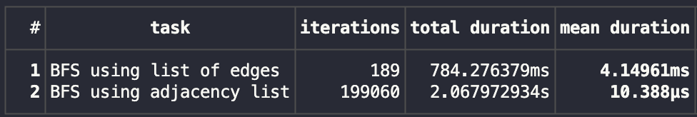
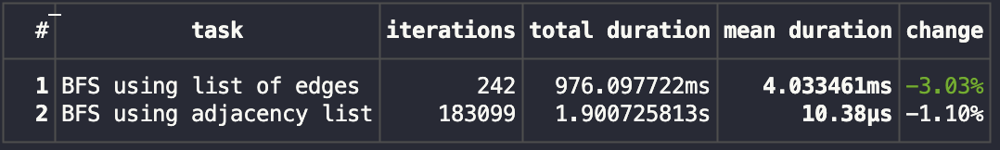
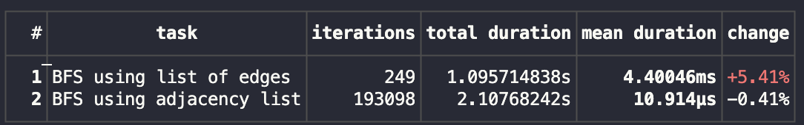
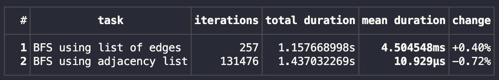

# [EVOL HW1]: BFS
1) Алгоритм для обхода графа в ширину (BFS) реализован в двух вариантах: 
   - для графа в виде списка ребер
   - для графа в виде списка смежности
2) Время работы алгоритма для графа в виде списка смежности **O(|V| + |E|)**, так как каждую вершину мы посещаем не более одного раза и смотрим не более **sum { deg(v_i) for v in V } = 2 * |E|** ребер. Для реализации в виде списка ребер мы так же посещаем все вершины не более одного раза, однако при этом просмтриваем все ребра для поиска нужных - время работы **O(|V| * |E|)**. valgrind не показал особых отличий в занимаемой памяти, однако бенчмаркинг времени работы сильно отличается:
   - сравнение времени работы с `opt-level = 0`:

   -  сравнение времени работы с `opt-level = 1`:

   -  сравнение времени работы с `opt-level = 2`:

   -  сравнение времени работы с `opt-level = 3`:

Таким образом, реализации с уровнем оптимизаций компилятора 0 и 1 получили наилучшие результаты. Большие оптимизации увеличили время работы. Кроме того, реализация на списке смежности во много раз быстрее реализации для списка ребер (что было ожидаемо).